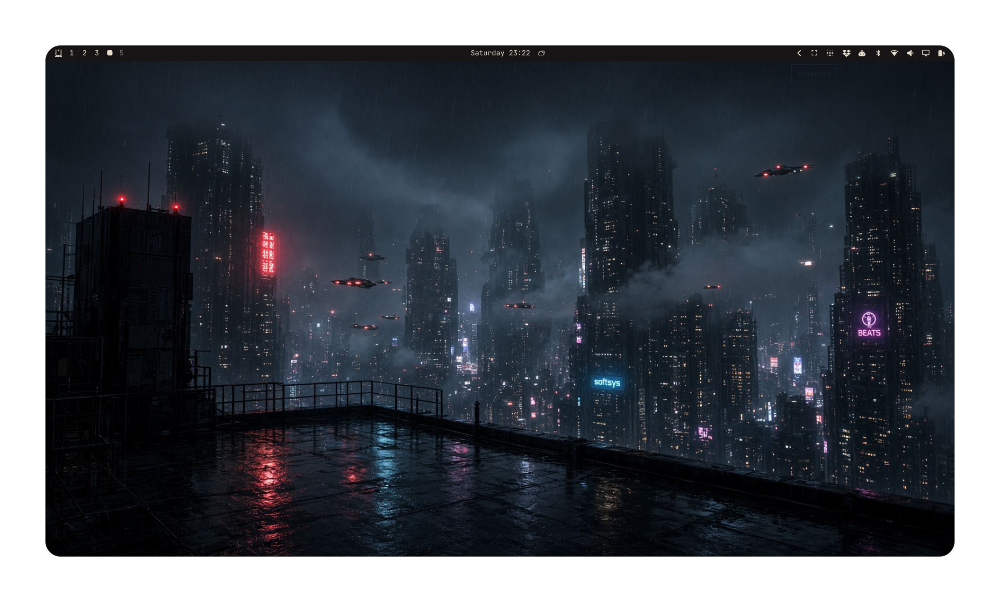
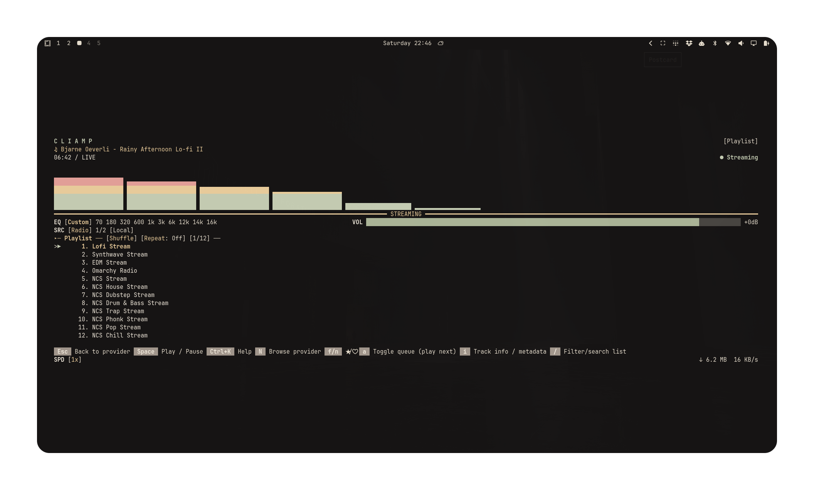
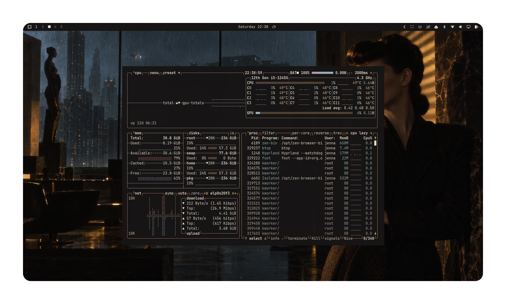
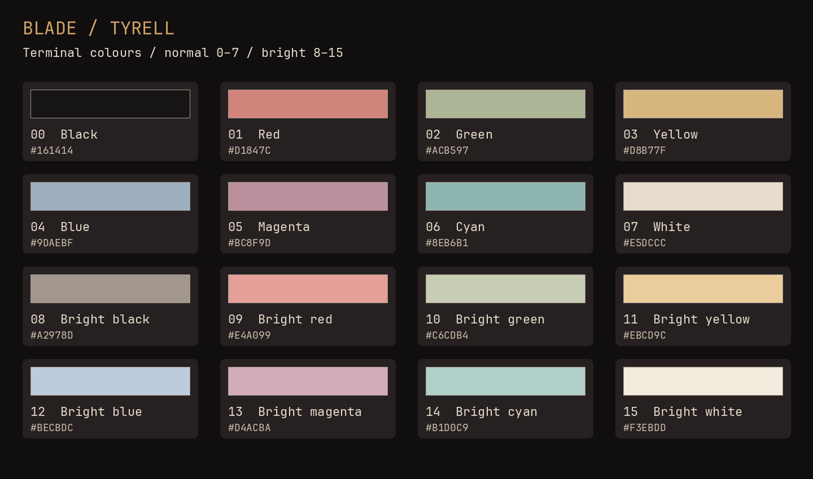
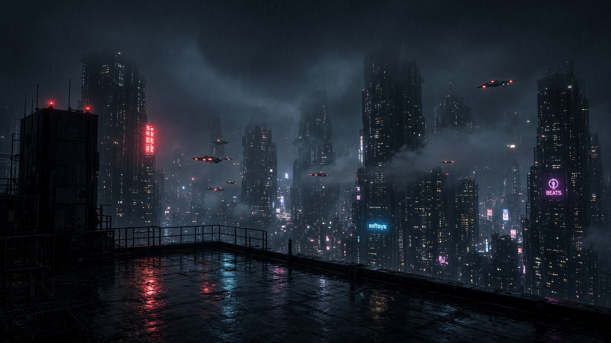
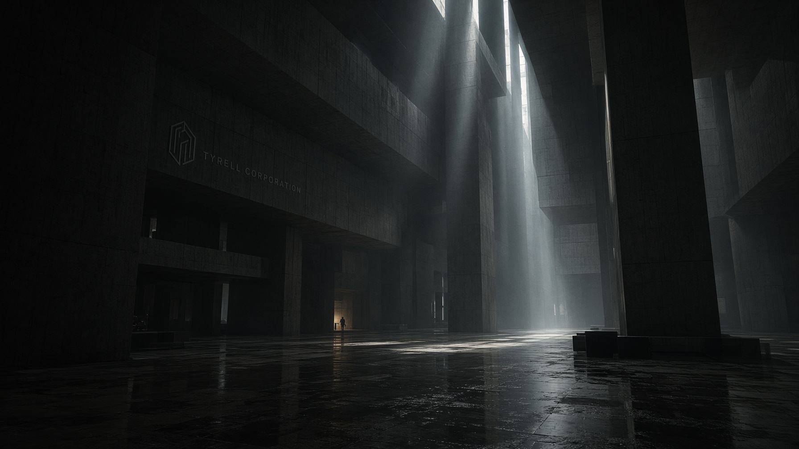
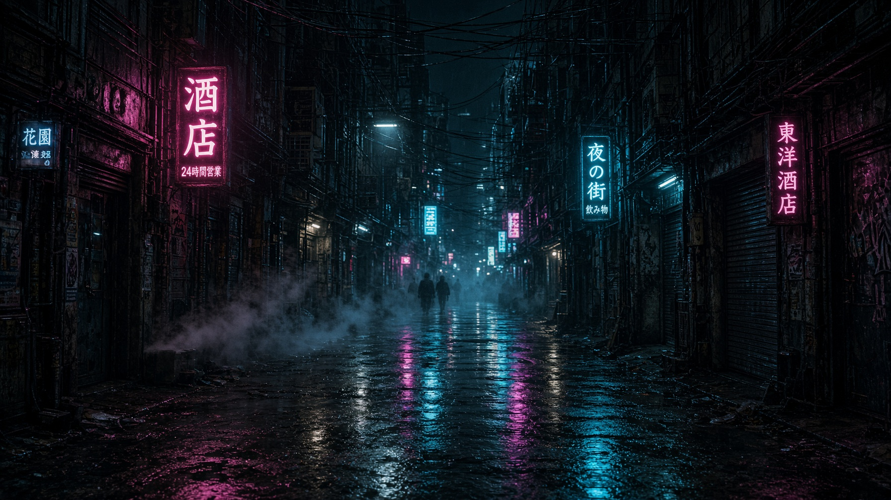
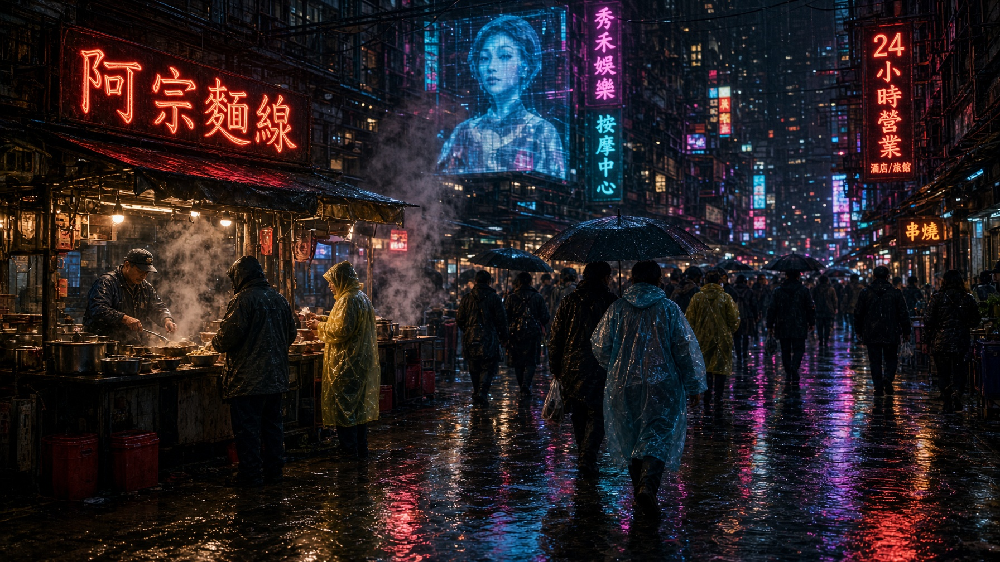
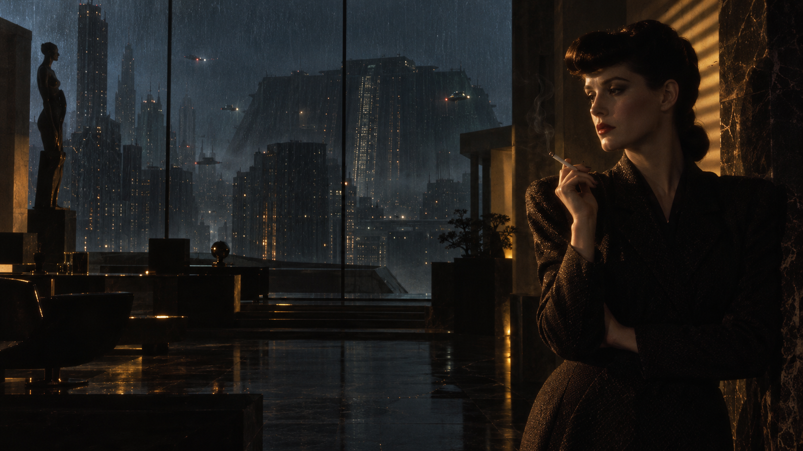
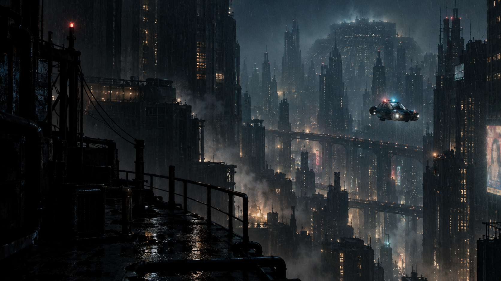

# Blade Theme for Omarchy

**Six scenes from a rainy future. Charcoal shadows. Tobacco-gold light.**

A dark Omarchy theme inspired by Blade Runner's noir atmosphere and the warm interiors of Tyrell's world. Ivory text, restrained gold highlights and muted burgundy accents sit against rain-soaked streets, monumental architecture and distant city lights.

<p align="center">
  
</p>

## Install

Install directly from GitHub:

```bash
omarchy theme install https://github.com/jennabrinning/omarchy-blade-theme
```

Omarchy installs and applies **Blade**.

To apply it again later:

```bash
omarchy theme set "Blade"
```

Cycle the six scenes with `omarchy theme bg next`.

Recommended font: JetBrainsMono Nerd Font, included with Omarchy.

## On the desktop

<p align="center">
  
</p>

The music player shows the Tyrell palette across text, highlights and equalizer bars. Window layout and transparency follow the user's desktop settings.

<p align="center">
  
</p>

Rachael's amber-lit penthouse brings out the warm palette. The floating activity monitor demonstrates the terminal colours against the wallpaper.

## Terminal colour palette

Every terminal slot in index order: normal colours **0–7**, then bright colours **8–15**. The chart is generated directly from `colors.toml` and follows Omarchy's terminal templates, including the muted colour in bright-black slot 8.

<p align="center">
  
</p>

| Desktop role | Colour | Use |
| --- | --- | --- |
| Background | `#161414` | Terminal and app surfaces |
| Deep background | `#100E0E` | Darker surfaces |
| Foreground | `#E5DCCC` | Main text |
| Tobacco-gold accent | `#D0A267` | Focus, active borders and bar attention states |
| Burgundy accent | `#BC8F9D` | Magenta terminal slot and syntax accents |
| Selection | `#514032` | Text selection background |
| Selection text | `#E5DCCC` | Text within selections |
| Muted text | `#A2978D` | Comments and secondary text |

## Six scenes

The four Grok wallpapers are **1792 × 1008**; Rachael and Spinner are **1672 × 941**. Click an image to open the full-resolution file.

<table>
  <tr>
    <td width="50%" align="center"><a href="backgrounds/01-rooftop.jpg"></a><br><b>Rooftop · city in the rain</b><br>A quiet skyline and scattered neon reflections.</td>
    <td width="50%" align="center"><a href="backgrounds/02-tyrell.jpg"></a><br><b>Tyrell · monumental silence</b><br>Deep shadows and towering architecture.</td>
  </tr>
  <tr>
    <td width="50%" align="center"><a href="backgrounds/03-alley.jpg"></a><br><b>Alley · after hours</b><br>Misty cyan and rose light on wet pavement.</td>
    <td width="50%" align="center"><a href="backgrounds/04-market.jpg"></a><br><b>Market · street life</b><br>Warm food-stall light beneath the neon.</td>
  </tr>
  <tr>
    <td width="50%" align="center"><a href="backgrounds/05-rachael.png"></a><br><b>Rachael · Tyrell's window</b><br>Ivory, tobacco gold and a rainy blue city.</td>
    <td width="50%" align="center"><a href="backgrounds/06-spinner.png"></a><br><b>Spinner · night patrol</b><br>A distant vehicle above a vast city canyon.</td>
  </tr>
</table>

Landscape displays preferable. Fill mode on ultrawide, 16:10 or portrait displays may crop parts of the scene.

## Artwork and license

The Rooftop, Tyrell, Alley and Market wallpapers were generated with Grok. Rachael and Spinner were generated with OpenAI image generation.

[MIT licensed](LICENSE). Blade is a community fan theme, not affiliated with Omarchy or the film's creators or rights holders.
